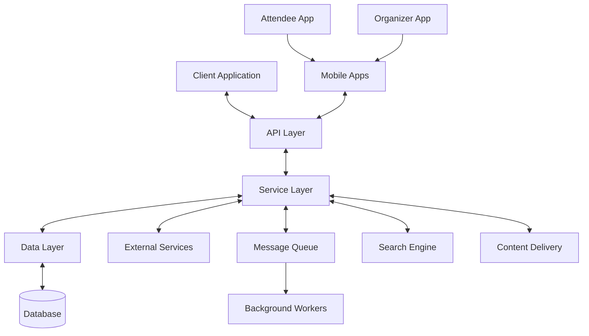
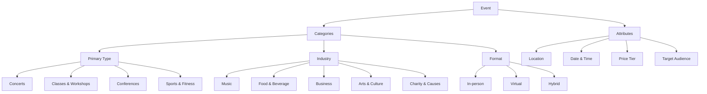
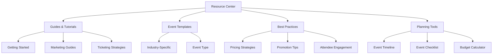
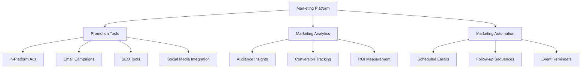
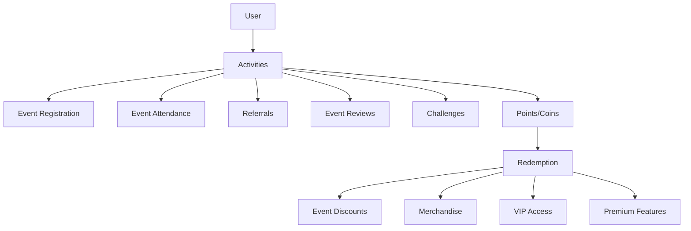
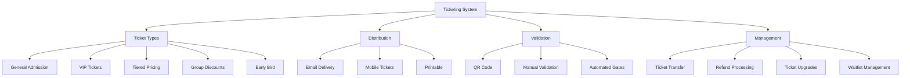

# System Patterns

## Architecture Overview
AwesomeEvent follows a modern web application architecture with a clear separation of concerns:

## Design Patterns

### Frontend Architecture
- **Component-Based Design**: Building UI with reusable, isolated components
- **Flux/Redux Pattern**: For state management, ensuring predictable state updates
- **Container/Presentational Pattern**: Separating logic from presentation
- **Responsive Design**: Using fluid layouts and media queries for device compatibility
- **Compound Component Pattern**: For building complex interactive elements like filters
- **Custom Hooks**: For reusing stateful logic across different components
- **Progressive Web App**: For mobile-first experience and offline capabilities
- **Micro-frontends**: For specialized industry-specific modules
- **Feature Flags**: For gradual rollout of new features
- **Localization Pattern**: For supporting multiple languages and regions

### Backend Architecture
- **RESTful API Design**: For consistent and scalable API endpoints
- **Microservices**: For certain isolated functionalities where appropriate
- **Repository Pattern**: For data access abstraction
- **Service Layer**: For business logic encapsulation
- **Dependency Injection**: For loose coupling and testability
- **Event-Driven Architecture**: For handling asynchronous operations like notifications
- **CQRS Pattern**: For separating read and write operations on high-traffic components
- **API Gateway**: For routing and aggregating service requests
- **BFF (Backend for Frontend)**: Specialized endpoints for different clients
- **Saga Pattern**: For managing distributed transactions

## Component Relationships

### Frontend Components
- **Layout Components**: Define the overall structure of pages
- **Container Components**: Manage state and data fetching
- **Presentational Components**: Render UI based on props
- **Form Components**: Handle user input and validation
- **Utility Components**: Provide common functionality across the application
- **Filter Components**: Enable advanced search and discovery functionality
- **Dashboard Widgets**: Modular components for analytics and user dashboards
- **Category-specific Components**: Specialized UI for different event types
- **Organizer Resource Components**: Educational content and guides
- **Marketing Tool Components**: Event promotion and audience targeting

### Backend Components
- **Controllers**: Handle HTTP requests and responses
- **Services**: Implement business logic
- **Repositories**: Access data storage
- **Models**: Define data structures
- **Middleware**: Process requests before they reach controllers
- **Background Workers**: Handle asynchronous and scheduled tasks
- **Notification Services**: Manage push notifications and emails
- **Payment Processors**: Handle financial transactions securely
- **Search Indexers**: Maintain searchable event indexes
- **Industry-specific Services**: Specialized logic for different verticals

## Data Flow
1. User interacts with the UI
2. Frontend components dispatch actions
3. Actions are processed by state management
4. API requests are made to the backend
5. Backend controllers receive requests
6. Services process business logic
7. Repositories interact with the database
8. Response flows back through the layers
9. Background processes may be triggered for delayed operations

## Enhanced Categorization System
Based on insights from both Howei.com and Eventbrite:

## Error Handling
- **Global Error Boundary**: Catches uncaught exceptions in the UI
- **API Error Standardization**: Consistent error format across the API
- **Graceful Degradation**: Maintaining functionality when parts fail
- **Comprehensive Logging**: For troubleshooting and monitoring
- **Retry Mechanism**: For transient failures in external service connections
- **Fallback UIs**: Showing alternative content when components fail
- **Circuit Breaker Pattern**: Preventing cascading failures
- **Error Telemetry**: Capturing detailed error information for analysis

## Security Patterns
- **Authentication Middleware**: Verifies user identity
- **Authorization Checks**: Enforces access control
- **Input Validation**: Prevents injection attacks
- **CSRF Protection**: Guards against cross-site request forgery
- **Rate Limiting**: Prevents abuse and DoS attacks
- **OAuth Integration**: For secure social login
- **Payment Information Security**: Following PCI DSS standards
- **Data Encryption**: Protecting sensitive information
- **Audit Logging**: Tracking security-relevant events
- **Two-factor Authentication**: Additional security layer for sensitive operations

## Scalability Patterns
- **Horizontal Scaling**: Adding more instances of services
- **Caching**: Reducing database load for frequently accessed data
- **Database Indexing**: Optimizing query performance
- **Asynchronous Processing**: Using message queues for non-immediate tasks
- **Content Delivery Network**: For static assets and media files
- **Database Sharding**: For handling large volumes of event and user data
- **Read Replicas**: For scaling read-heavy operations
- **Serverless Functions**: For cost-effective scaling of certain operations
- **Auto-scaling**: Dynamically adjusting resources based on traffic
- **Edge Computing**: Moving computation closer to the user

## Mobile Integration Patterns
- **API Versioning**: Ensuring backward compatibility
- **Responsive Image Delivery**: Serving appropriate image sizes
- **Offline First**: Enabling core functionality without internet connection
- **Push Notification System**: For timely updates and reminders
- **Deep Linking**: For navigating directly to specific content
- **QR Code System**: For quick check-ins and information retrieval
- **Specialized App Experiences**: Different functionality for attendees vs. organizers
- **Biometric Authentication**: For secure and convenient login

## Organizer Resource System
New pattern based on Eventbrite insights:

## Marketing Tools System
New pattern based on Eventbrite insights:

## Rewards System (Inspired by HoweiCoin)

## Ticketing System
New pattern based on Eventbrite insights:

## Testing Strategy
- **Unit Tests**: For individual functions and components
- **Integration Tests**: For component interactions
- **End-to-End Tests**: For complete user workflows
- **Performance Tests**: For ensuring scalability and responsiveness
- **Accessibility Tests**: For WCAG compliance
- **Mobile Responsiveness Tests**: For cross-device compatibility
- **Security Testing**: For identifying vulnerabilities
- **A/B Testing**: For optimizing user experiences
- **Load Testing**: For handling peak traffic scenarios
- **User Acceptance Testing**: With real event organizers and attendees 

### Component Patterns
1. Atomic Design Structure
   - Atoms (basic components)
   - Molecules (composite components)
   - Organisms (complex components)
   - Templates (page layouts)
   - Pages (complete views)

2. Container Pattern
   - Separation of data fetching and presentation
   - Smart containers for business logic
   - Dumb components for UI rendering

3. HOC Patterns
   - Authentication wrapper
   - Layout wrapper
   - Error boundary wrapper

### State Management
1. Redux Pattern
   - Action creators
   - Reducers
   - Selectors
   - Middleware

2. Local State Management
   - React hooks for component state
   - Context for shared state
   - SWR for remote state

## UI Component Library
- Headless UI components
- Custom themed components
- Tailwind CSS utility classes
- Responsive design patterns

## Form Patterns
- Controlled components
- Form validation with React Hook Form
- Error handling and feedback
- Async submission handling

## Routing Patterns
- Dynamic routes
- Nested layouts
- Protected routes
- Query parameter handling

## Error Handling
- Global error boundary
- API error handling
- Form validation errors
- Network error recovery

## Performance Patterns
- Code splitting
- Lazy loading
- Image optimization
- Cache management
- Bundle optimization 