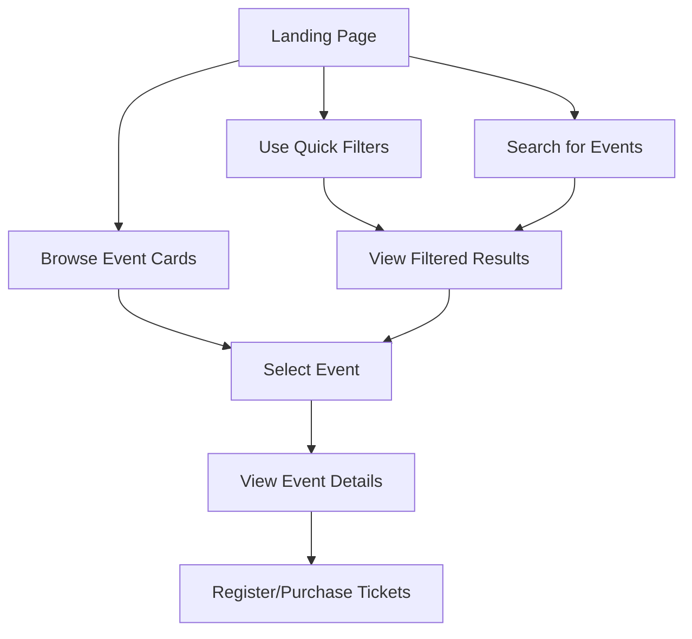
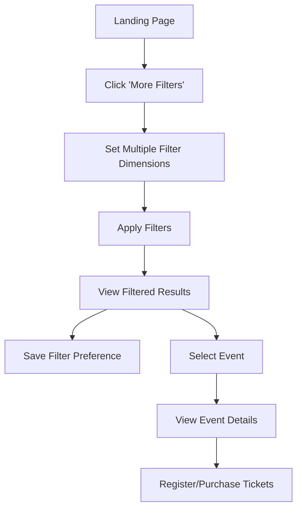
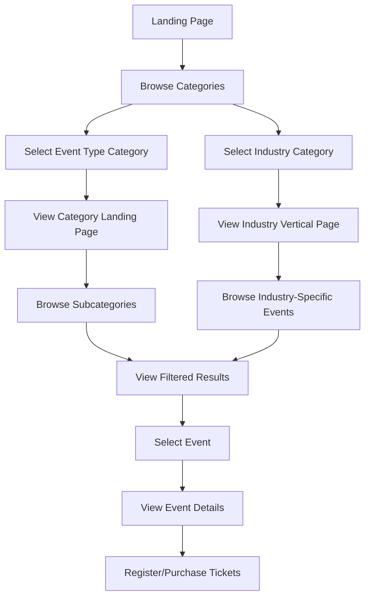

# UI/UX Wireframes - Enhanced Categorization System

## Overview
This document outlines the UI/UX approach for AwesomeEvent's enhanced categorization system, which combines insights from both Howei.com and Eventbrite. The multi-dimensional categorization is a key differentiator for our platform, enabling users to discover events more effectively.

## Principles

### 1. Multi-dimensional Filtering
Users should be able to filter events across multiple dimensions simultaneously:
- Event Type (e.g., Concert, Workshop, Conference)
- Industry (e.g., Music, Food & Beverage, Business)
- Format (e.g., In-person, Virtual, Hybrid)
- Location (City, Region, Country)
- Date/Time
- Price Range
- Target Audience

### 2. Progressive Disclosure
- Present the most common filters by default
- Allow users to add additional filters as needed
- Maintain a clean interface that doesn't overwhelm users

### 3. Visual Clarity
- Use clear visual hierarchies
- Employ consistent iconography for each category
- Utilize color coding for primary categories
- Ensure accessibility in all design elements

### 4. Persistent Filter State
- Maintain filter selections across page navigations
- Allow users to save filter combinations as preferences
- Display currently active filters prominently

## Key Screens and Components

### 1. Main Discovery Page

```
+-------------------------------------------------------+
| AwesomeEvent                         Profile | Login  |
+-------------------------------------------------------+
| DISCOVER EVENTS                                       |
|                                                       |
| [Search Bar                                      ]    |
|                                                       |
| Primary Filters:                                      |
| [All Types ▼] [All Industries ▼] [Location ▼] [Date ▼]|
|                                                       |
| More Filters + |                                      |
|                                                       |
| View: [Grid] [List] [Map]          Sort: [Relevance ▼]|
|                                                       |
| Featured Events:                                      |
| +------------+  +------------+  +------------+       |
| |            |  |            |  |            |       |
| |  Event 1   |  |  Event 2   |  |  Event 3   |       |
| |            |  |            |  |            |       |
| | Type: Music|  |Type: Tech  |  |Type: Food  |       |
| | Date: 10/15|  |Date: 10/20 |  |Date: 10/22 |       |
| +------------+  +------------+  +------------+       |
|                                                       |
| Upcoming Events:                                      |
| +------------+  +------------+  +------------+       |
| |            |  |            |  |            |       |
```

### 2. Expanded Filter Panel

```
+-------------------------------------------------------+
| FILTERS                                          [X]  |
+-------------------------------------------------------+
| EVENT TYPE                    | INDUSTRY              |
| [ ] Concerts                  | [ ] Music             |
| [ ] Classes & Workshops       | [ ] Food & Beverage   |
| [ ] Conferences               | [ ] Business          |
| [ ] Sports & Fitness          | [ ] Arts & Culture    |
| [ ] Festivals & Fairs         | [ ] Education         |
| [ ] Networking                | [ ] Technology        |
| [ ] Exhibitions               | [ ] Health & Wellness |
| More...                       | More...               |
|                               |                       |
| FORMAT                        | AUDIENCE              |
| [ ] In-person                 | [ ] All Ages          |
| [ ] Virtual                   | [ ] Adults (18+)      |
| [ ] Hybrid                    | [ ] Professionals     |
|                               | [ ] Families          |
|                               | [ ] Children          |
|                               |                       |
| PRICE                         | DATE                  |
| [ ] Free                      | [ ] Today             |
| [ ] $                         | [ ] This Weekend      |
| [ ] $$                        | [ ] This Week         |
| [ ] $$$                       | [ ] This Month        |
| [ ] Custom Range:             | [ ] Custom Range:     |
| From: [____] To: [____]       | From: [__] To: [__]   |
|                               |                       |
| [APPLY FILTERS]               | [CLEAR ALL]           |
+-------------------------------------------------------+
```

### 3. Category Landing Pages

```
+-------------------------------------------------------+
| AwesomeEvent > Sports & Fitness                       |
+-------------------------------------------------------+
| SPORTS & FITNESS EVENTS                               |
|                                                       |
| Popular Categories:                                   |
| [Running] [Cycling] [Yoga] [Hiking] [Team Sports]     |
|                                                       |
| Featured Sports Events:                               |
| +------------+  +------------+  +------------+       |
| |            |  |            |  |            |       |
| | Marathon   |  | Yoga Class |  | Bike Tour  |       |
| |            |  |            |  |            |       |
| +------------+  +------------+  +------------+       |
|                                                       |
| This Weekend:                                         |
| +------------+  +------------+  +------------+       |
| |            |  |            |  |            |       |
| | Event 1    |  | Event 2    |  | Event 3    |       |
| |            |  |            |  |            |       |
| +------------+  +------------+  +------------+       |
|                                                       |
| Upcoming:                                             |
| +------------+  +------------+  +------------+       |
| |            |  |            |  |            |       |
```

### 4. Industry Vertical Pages

```
+-------------------------------------------------------+
| AwesomeEvent > Industries > Music                     |
+-------------------------------------------------------+
| MUSIC INDUSTRY EVENTS                                 |
|                                                       |
| Popular Categories:                                   |
| [Concerts] [Festivals] [Workshops] [Networking]       |
|                                                       |
| For Music Professionals:                              |
| +------------+  +------------+  +------------+       |
| |            |  |            |  |            |       |
| | Conference |  | Workshop   |  | Networking |       |
| |            |  |            |  |            |       |
| +------------+  +------------+  +------------+       |
|                                                       |
| For Music Fans:                                       |
| +------------+  +------------+  +------------+       |
| |            |  |            |  |            |       |
| | Concert    |  | Festival   |  | Live Music |       |
| |            |  |            |  |            |       |
| +------------+  +------------+  +------------+       |
|                                                       |
```

### 5. Mobile Filter Interface

```
+--------------------+    +--------------------+
| DISCOVER           |    | FILTERS            |
|                    |    |                    |
| [Search]           |    | EVENT TYPE         |
|                    |    | [Dropdown]         |
| FILTERS  [Edit]    |    |                    |
| Type: All          |    | INDUSTRY           |
| Date: This Week    |    | [Dropdown]         |
|                    |    |                    |
| [Show Results]     |    | FORMAT             |
|                    |    | [Toggle buttons]   |
| FEATURED EVENTS    |    |                    |
| +----------------+ |    | LOCATION           |
| |                | |    | [Current / Custom] |
| | Event 1        | |    |                    |
| |                | |    | DATE               |
| +----------------+ |    | [Calendar picker]  |
|                    |    |                    |
| +----------------+ |    | PRICE              |
| |                | |    | [Range slider]     |
| | Event 2        | |    |                    |
| |                | |    | [APPLY] [CLEAR]    |
| +----------------+ |    |                    |
+--------------------+    +--------------------+
```

## User Flows

### 1. Basic Discovery Flow



### 2. Advanced Discovery Flow



### 3. Category-Based Discovery Flow



## Filter Interactions

### Progressive Disclosure of Filters

1. **Initial State**: Show primary filters only (Type, Location, Date)
2. **Expanded State**: Reveal secondary filters when "More Filters" is clicked
3. **Mobile State**: Filters accessed through a dedicated filter panel/drawer

### Filter Selection Behavior

- Radio buttons for single-select options (e.g., view type)
- Checkboxes for multi-select options (e.g., event types)
- Dropdowns for options with many choices (e.g., location)
- Sliders for ranges (e.g., price)
- Date pickers for temporal filters

### Applied Filter Indicators

- Pills/chips showing active filters
- Easy removal of individual filters by clicking an "×" on each pill
- "Clear all" option to reset filters
- Count of applied filters visible at all times

## Event Card Design

### Standard Event Card

```
+----------------------------------+
|                                  |
|           [EVENT IMAGE]          |
|                                  |
+----------------------------------+
| TITLE OF THE EVENT               |
+----------------------------------+
| Category    |    Date & Time     |
+----------------------------------+
| Location                         |
+----------------------------------+
| Price                            |
+----------------------------------+
| [Register/Get Tickets]           |
+----------------------------------+
```

### Enhanced Event Card (with Category Indicators)

```
+----------------------------------+
| [Type Icon]        [Industry Tag]|
|                                  |
|           [EVENT IMAGE]          |
|                                  |
+----------------------------------+
| TITLE OF THE EVENT               |
+----------------------------------+
| Category    |    Date & Time     |
+----------------------------------+
| Location    |    Format Icon     |
+----------------------------------+
| Price       |    [Quick Action]  |
+----------------------------------+
```

## Responsive Considerations

### Desktop
- Grid view with 3-4 events per row
- Expanded filter panel in sidebar
- Map view option alongside grid/list views

### Tablet
- Grid view with 2-3 events per row
- Collapsible filter panel
- Swipeable category carousels

### Mobile
- Single column grid view
- Filter drawer accessed via button
- Sticky filter bar with primary filters
- Bottom sheet for quick filter access

## Accessibility Considerations

- Clear contrast between filter elements
- Keyboard navigable filters
- Screen reader friendly filter descriptions
- Alternative text for category icons
- Focus states for all interactive elements
- Sufficient touch targets on mobile

## Technical Implementation Notes

1. Store filter state in URL parameters for shareable filtered views
2. Implement lazy loading for event cards when scrolling
3. Use client-side filtering for quick responses to filter changes
4. Cache filter preferences in local storage for returning users
5. Use service workers to enable offline access to filtered results
6. Implement analytics tracking for filter usage patterns

## Next Steps

1. Create high-fidelity mockups of the filter interface
2. Conduct usability testing with potential users
3. Implement A/B testing of different filter layouts
4. Develop priority metric for showing most relevant results
5. Design custom iconography for category system 